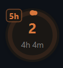
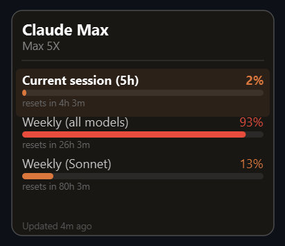

# Claude Usage Meter

A cross-platform desktop application that displays Claude API usage in a beautiful floating overlay widget.


## Screenshots

<table align="center">
  <tr>
    <td align="center">
      
      <br>
      <em>Floating circular usage indicator</em>
    </td>
    <td align="center">
      
      <br>
      <em>Detailed usage tooltip on hover</em>
    </td>
  </tr>
</table>

## Features

- **Real-time Usage Tracking**: Monitor your Claude API usage across multiple time windows
- **Floating Widget**: Unobtrusive circular indicator that stays on top of all windows
- **Multiple Display Modes**: Toggle between 5-hour session and 7-day usage with a single click
- **Detailed Tooltip**: Hover to see comprehensive usage breakdown across all models and categories
- **Customizable Appearance**: Extensive settings dialog to personalize colors, fonts, size, and display options
- **Smart Positioning**: Drag to move, automatically snaps to screen edges
- **System Tray Integration**: Minimize to tray with quick access to controls
- **OAuth Integration**: Seamlessly integrates with Claude Code CLI credentials

## Display Modes

The floating indicator shows different usage windows:

- **5h** (Session): Current rolling 5-hour usage window
- **7d** (Weekly): Rolling 7-day usage across all models

Left-click the circle to toggle between modes.

## Usage Categories

The detailed tooltip displays usage for:
- **Current session (5h)**: Your immediate usage window
- **Weekly (all models)**: Total usage across Sonnet, Opus, and Haiku
- **Weekly (Sonnet)**: Claude Sonnet-specific usage

## Color Indicators

- **Orange** (0-50%): Normal usage levels
- **Amber** (50-80%): Moderate usage
- **Red** (80-100%): High usage, approaching limits

## Installation

### Prerequisites

- Python 3.10 or higher
- Windows 10/11, macOS 10.14+, or Linux (Ubuntu 20.04+, Fedora, etc.)
- [Claude Code CLI](https://claude.com/code) installed and configured

### From Source

1. Clone the repository:
```bash
git clone https://github.com/YOUR_USERNAME/claude-usage-meter.git
cd claude-usage-meter
```

2. Install dependencies:
```bash
pip install PySide6 requests
```

3. Run the application:
```bash
python app.py
```

### Building Executable

To build a standalone executable for your platform:

1. Install PyInstaller:
```bash
pip install pyinstaller
```

2. Run the build script:
```bash
python build.py
```

The executable will be created in the `dist/` directory:
- **Windows**: `dist/ClaudeUsageMeter.exe`
- **macOS**: `dist/ClaudeUsageMeter.app`
- **Linux**: `dist/ClaudeUsageMeter`

#### Platform-Specific Notes

**macOS**:
- The app bundle can be moved to `/Applications` for easy access
- You may need to allow the app in System Preferences → Security & Privacy on first run
- On macOS, `iconutil` is used to generate the `.icns` icon

**Linux**:
- Make the binary executable: `chmod +x dist/ClaudeUsageMeter`
- Some distributions may require additional Qt dependencies:
  ```bash
  # Ubuntu/Debian
  sudo apt-get install libxcb-xinerama0 libxcb-cursor0

  # Fedora
  sudo dnf install qt6-qtbase-gui
  ```

## Authentication

The application uses OAuth credentials from Claude Code CLI. Make sure you're logged in:

```bash
claude /login
```

Credentials are stored in `~/.claude/.credentials.json` and automatically refreshed when needed.

## Configuration

The application stores its configuration in:
- **Credentials**: `~/.claude/.credentials.json` (managed by Claude Code CLI)
- **Widget Position**: `~/.claude/meter-position.json` (automatically saved)
- **Settings**: `~/.claude/meter-settings.json` (appearance and behavior preferences)

## Customization

Access the Settings dialog via the right-click menu to customize:

### Appearance
- **Indicator Radius**: Adjust the size of the floating circle (10-50 pixels)
- **Colors**: Customize all color elements including:
  - Font color
  - Background color
  - Arc colors for different usage levels (0-50%, 50-80%, 80-100%)
- **Font**: Choose from multiple font families and sizes
- **Visibility Options**: Toggle percentage numbers and mode badges

### Display Options
- **Refresh Display**: Configure how reset times are shown:
  - **Time Until**: Shows countdown (e.g., "2h 14m", "3d 5h")
  - **Date**: Shows reset date (e.g., "Feb 15")
  - **None**: Hides reset time information
- Separate settings for Current Session (5h) and Weekly Session (7d)

All changes are previewed in real-time and can be reverted with the "Restore Defaults" button.

## Usage

### Controls

- **Left Click**: Toggle between display modes (5h ↔ 7d)
- **Right Click**: Open context menu
  - Refresh: Manually update usage data
  - Log in: Open Claude Code login flow
  - Settings: Customize appearance and behavior
  - Quit: Exit the application
- **Drag**: Move the widget (automatically snaps to screen edges)
- **Hover**: Show detailed usage tooltip

### System Tray

- **Left Click Tray Icon**: Show/hide the indicator
- **Right Click Tray Icon**: Access menu
  - Show/Hide Indicator
  - Refresh
  - Quit

## Technical Details

### Architecture

- **Framework**: PySide6 (Qt for Python)
- **API**: Anthropic OAuth API
- **Threading**: Background worker thread for API calls
- **UI**: Fully transparent overlay with custom-painted circular widget

### API Polling

- Usage data is automatically refreshed every 5 minutes
- Token refresh handled automatically
- Failed requests trigger re-authentication flow

### Dependencies

- `PySide6`: Qt framework for Python
- `requests`: HTTP library for API calls
- Standard library: `json`, `pathlib`, `datetime`, `subprocess`

## Development

### Project Structure

```
claude-usage-meter/
├── app.py                    # Main application
├── settings.py               # Settings dialog and configuration
├── build.py                  # PyInstaller build script
├── ClaudeUsageMeter.spec    # PyInstaller specification
├── icon.ico                 # Application icon
└── README.md                # This file
```

### Building from Source

```bash
# Install development dependencies
pip install pyinstaller

# Run the build script (automatically detects your platform)
python build.py

# The executable will be in dist/
# - Windows: ClaudeUsageMeter.exe
# - macOS:   ClaudeUsageMeter.app
# - Linux:   ClaudeUsageMeter
```

### Cross-Platform Icon Generation

The build script automatically generates platform-appropriate icons:
- **Windows**: `.ico` file with multiple sizes (16x16 to 256x256)
- **macOS**: `.icns` file using `iconutil` (falls back to PNG if unavailable)
- **Linux**: High-resolution `.png` file (256x256)

Icons are generated programmatically using Qt, ensuring consistency across platforms.

## Troubleshooting

### Widget not appearing
- Check if Claude Code CLI is installed: `claude --version`
- Verify you're logged in: `claude /login`
- Check credentials file exists: `~/.claude/.credentials.json`

### Authentication errors
- Run `claude /login` to re-authenticate
- Check internet connectivity
- Verify OAuth permissions

### API errors
- Check Claude Code CLI is up to date
- Verify your Claude subscription is active
- Check the console output for detailed error messages

## License

MIT License - feel free to use and modify as needed.

## Contributing

Contributions are welcome! Please feel free to submit a Pull Request.

## Acknowledgments

- Built for [Claude Code](https://claude.com/code) by Anthropic
- Uses the Anthropic OAuth API
- Inspired by the need for better visibility into API usage

## Changelog

### v1.1.0 (Current)
- **Settings Dialog**: Comprehensive customization options
  - Adjustable indicator size and colors
  - Font family and size selection
  - Configurable reset time display formats
  - Real-time preview of changes
- **Streamlined Usage Categories**: Focused view with Current Session, Weekly (all models), and Weekly (Sonnet)
- **Enhanced User Experience**: Toggle visibility options for numbers and badges

### v1.0.0 (Initial Release)
- Floating circular usage indicator
- Real-time OAuth integration
- Multiple display modes (5h, 7d)
- Detailed usage tooltip
- System tray integration
- Auto-refresh and token management
- Drag-to-move with edge snapping

## Support

For issues and questions:
- Open an issue on GitHub
- Check Claude Code documentation: https://claude.com/code
